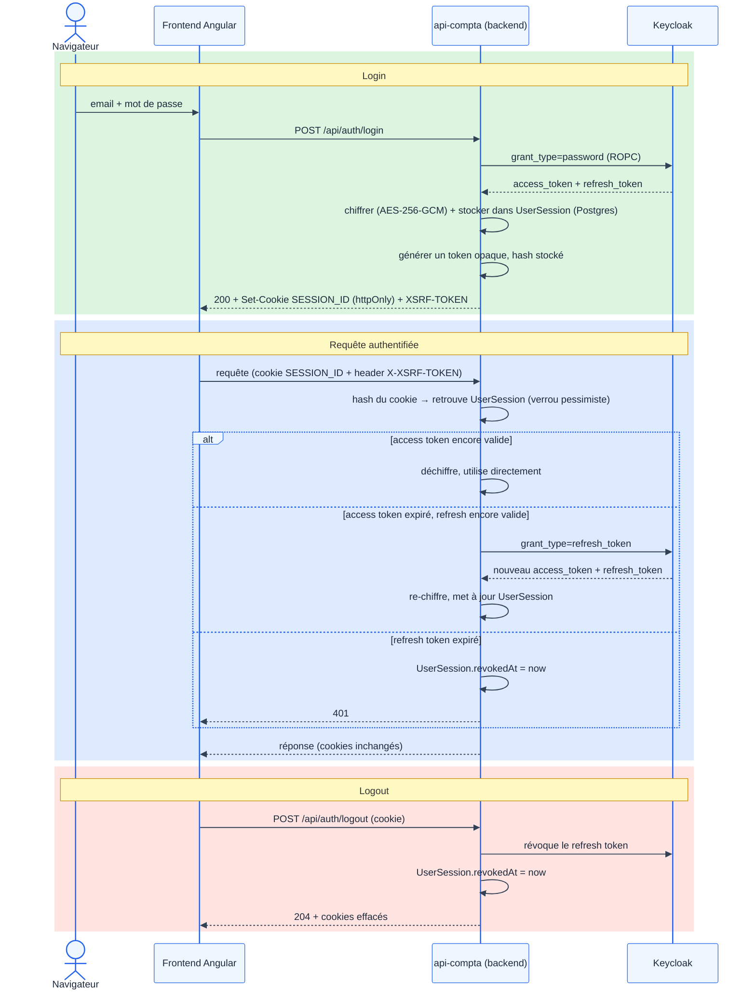

# Authentification — état actuel

## Principe

Architecture **backend-mediated (BFF)**. Le frontend échange email/mot de passe contre
un **cookie opaque httpOnly** — jamais un JWT Keycloak. Le backend détient et rafraîchit
les tokens Keycloak (access + refresh) pour le compte du frontend, chiffrés en base.

## Ce que ça résout

- **Vol de token via XSS** : impossible — le JS ne voit jamais de JWT ni de refresh token.
- **Déconnexion brutale pendant l'usage actif** : rafraîchissement transparent côté serveur
  + heartbeat frontend (ping léger tant que l'onglet est visible).
- **CSRF** : `SameSite=Strict` + cookie CSRF double-submit.
- **Brute-force / credential stuffing** : lockout Keycloak (`bruteForceProtected`) + rate
  limiting applicatif par IP sur les endpoints sensibles.
- **Fuite de données inter-entreprise** : isolation tenant imposée côté serveur (jamais un
  filtre fourni par le client).
- **Session figée en base de données claire** : tokens Keycloak stockés chiffrés (AES-256-GCM),
  jamais en clair.

## Flow

## Composants clés

| Fichier | Rôle |
|---|---|
| `AuthController` | endpoints `login` / `logout` / `definir-mot-de-passe` |
| `AuthSessionServiceImpl` | connecter / résoudre session (+ refresh) / déconnecter |
| `UserSession` (entity + migration) | tokens chiffrés, expirations, révocation |
| `TokenCipherService` | chiffrement AES-256-GCM des tokens stockés |
| `SessionCookieAuthenticationFilter` | résout le cookie à chaque requête, peuple l'authentification |
| `EmailVerifieFilter` | bloque tant que l'email n'est pas vérifié |
| `CsrfDoubleSubmitFilter` | vérifie `X-XSRF-TOKEN` == cookie `XSRF-TOKEN` |
| `RateLimitFilter` | limite les requêtes par IP sur les endpoints sensibles |
| `SessionCookieHelper` | construit/lit les cookies (session + CSRF) |
| `KeycloakAuthService` | échange identifiants/refresh contre des tokens Keycloak |

## Pourquoi PostgreSQL plutôt que Redis pour `UserSession`

- **Lecture** : indexée sur un hash unique, à chaque requête — le working set (sessions
  actives) est petit et tient dans le cache mémoire de Postgres, même à volume élevé.
- **Écriture** : seulement au rafraîchissement (~1×/5 min par utilisateur actif) — charge
  négligeable, pas de contention.
- **Cohérence** : même pattern déjà utilisé pour `UserToken` (vérification email, reset
  mot de passe) — pas de nouvelle techno à opérer/monitorer pour ce stade du projet.
- **Redis n'apporterait un gain réel qu'à un volume de requêtes** bien supérieur à celui de
  l'application actuelle — pas justifié sans données de charge réelles (optimisation
  prématurée).
- **Migration non bloquée** : la logique de session est encapsulée derrière
  `AuthSessionService`/`UserSessionRepository` — remplaçable par une implémentation Redis
  plus tard sans réécrire le reste, si le besoin apparaît.
